# Mini Tank — Embedded Robotic Vehicle

```
        .--._____,
     .-='=='==-, "
    (O_o_o_o_o_O)
```

A remotely controlled tracked vehicle designed and developed from scratch, combining embedded c++, robotics, 3D mechanical design and mobile software.

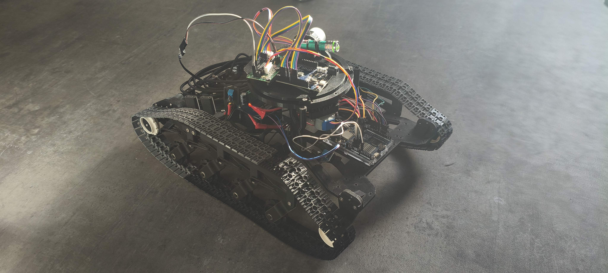

> *The final tank assembly with its turret* <br>

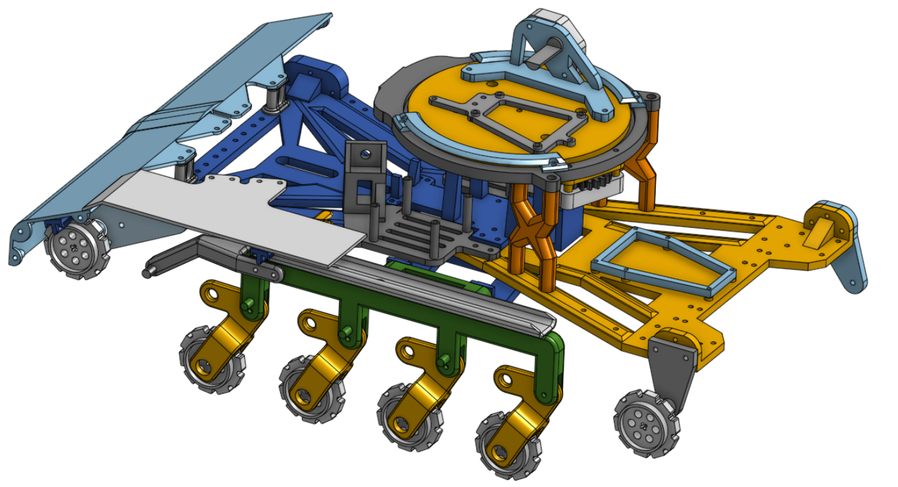<br>

> *The tank assembly in Onshape* <br>

## System architecture and diagrams

[](https://gitdiagram.com/a-bernard1/tank_app?utm_source=readme&utm_medium=picture)
---

## Main Features

- Wireless tank control : Embedded C++ firmware using the Arduino framework
- Differential drive
- Turret control
- Firing mechanism control
- Bluetooth communication
- Battery voltage monitoring
- Bluetooth Low Energy communication
---


## Hardware Overview

| Component | Description |
|---|---|
| Main controller | Arduino UNO R4 WiFi |
| Turret controller | Arduino UNO R3 |
| Motor drivers | 2× BTS7960 |
| Turret controls | 2× 28BYJ-48 stepper motors |
| Power supply | Custom PCB designed in KiCad |
| Battery | 12 V LiPo |
| Chassis | Fully 3D-printed, custom-designed |
| Suspension | Pseudo-3D Christie suspension |

## Final assembly

<br>
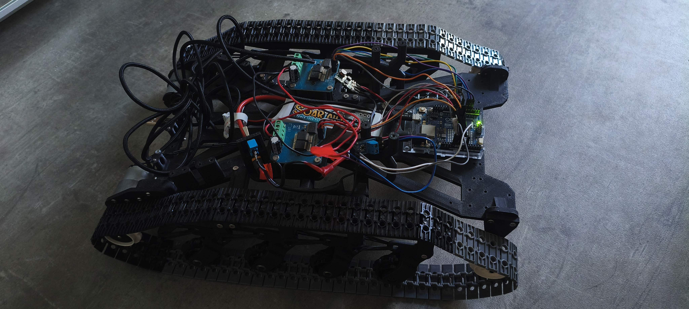<br>
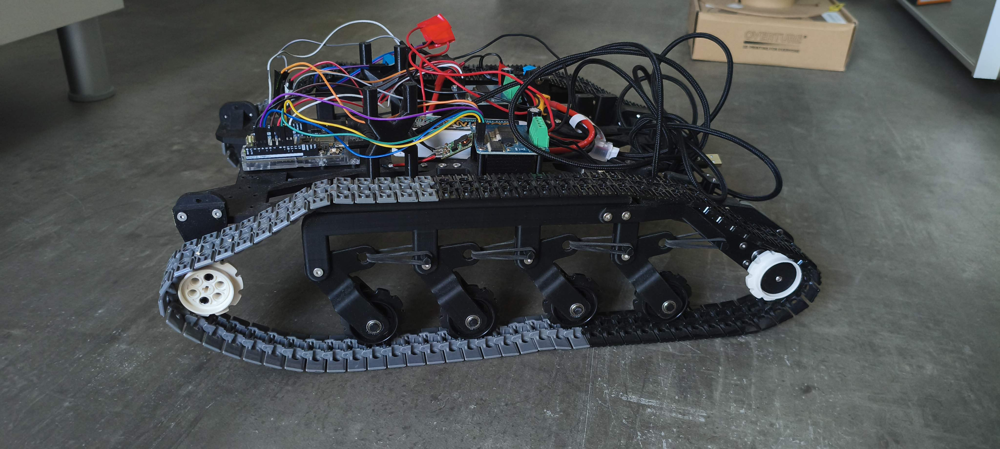<br>
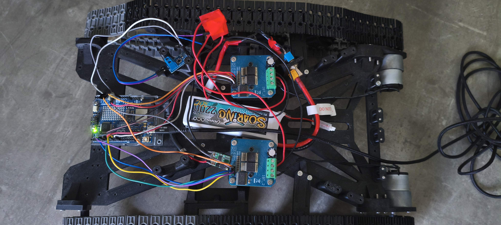


## Electronics

> (mettre screenshot kicad)


## Mechanical design
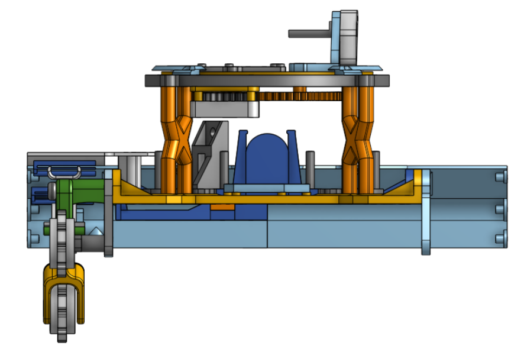<br>
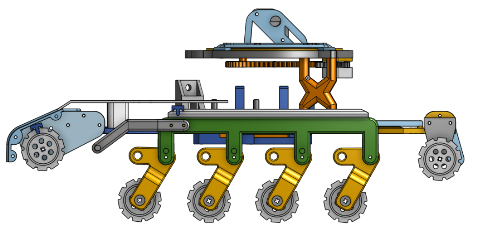


## Mobile app
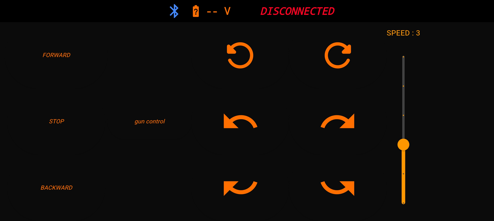<br>
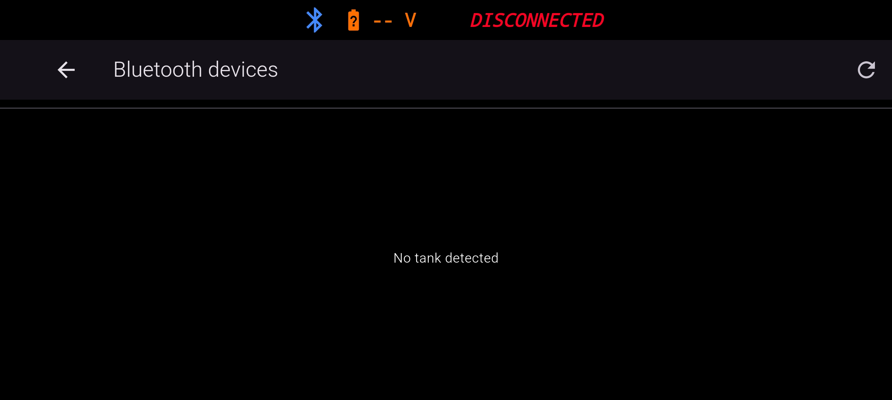<br>
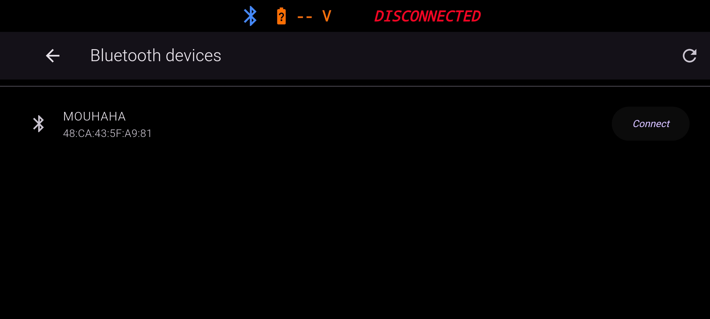<br>
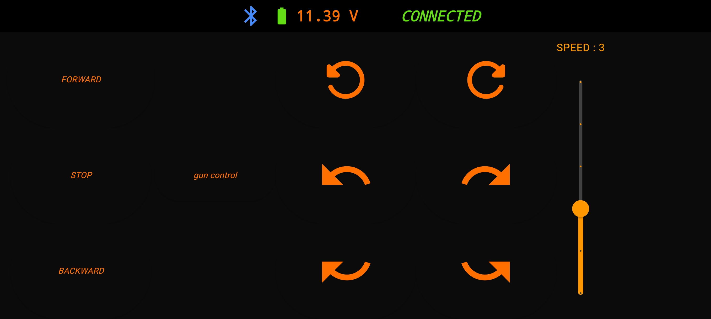<br>
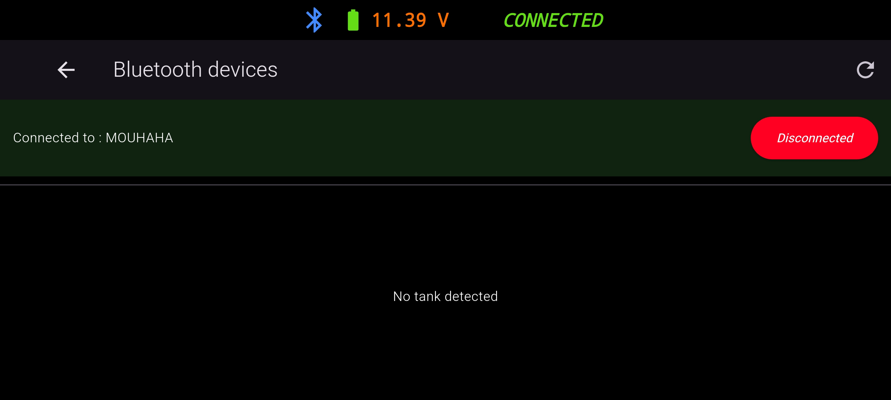<br>


## My Contribution

I designed and developed the project from scratch, including:

- Mechanical design and 3D modeling of the chassis and turret
- Design of the custom power supply PCB using KiCad
- Embedded firmware for the tank
- Motor and turret control
- Bluetooth communication
- Android application using Flutter


